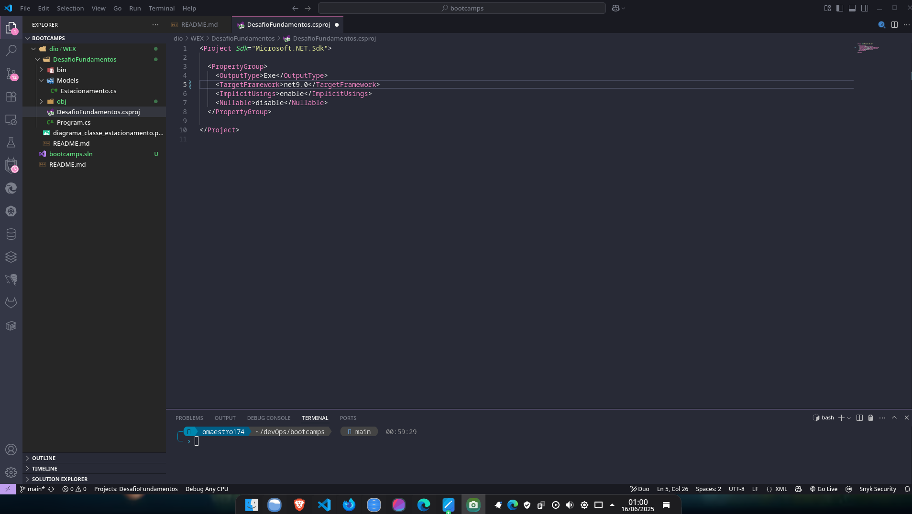

# DIO - Trilha .NET - Fundamentos
www.dio.me

## Desafio de projeto
Para este desafio, você precisará usar seus conhecimentos adquiridos no módulo de fundamentos, da trilha .NET da DIO.

## Contexto
Você foi contratado para construir um sistema para um estacionamento, que será usado para gerenciar os veículos estacionados e realizar suas operações, como por exemplo adicionar um veículo, remover um veículo (e exibir o valor cobrado durante o período) e listar os veículos.

## Proposta
Você precisará construir uma classe chamada "Estacionamento", conforme o diagrama abaixo:

A classe contém três variáveis, sendo:

**precoInicial**: Tipo decimal. É o preço cobrado para deixar seu veículo estacionado.

**precoPorHora**: Tipo decimal. É o preço por hora que o veículo permanecer estacionado.

**veiculos**: É uma lista de string, representando uma coleção de veículos estacionados. Contém apenas a placa do veículo.

A classe contém três métodos, sendo:

**AdicionarVeiculo**: Método responsável por receber uma placa digitada pelo usuário e guardar na variável **veiculos**.

**RemoverVeiculo**: Método responsável por verificar se um determinado veículo está estacionado, e caso positivo, irá pedir a quantidade de horas que ele permaneceu no estacionamento. Após isso, realiza o seguinte cálculo: **precoInicial** * **precoPorHora**, exibindo para o usuário.

**ListarVeiculos**: Lista todos os veículos presentes atualmente no estacionamento. Caso não haja nenhum, exibir a mensagem "Não há veículos estacionados".

Por último, deverá ser feito um menu interativo com as seguintes ações implementadas:
1. Cadastrar veículo
2. Remover veículo
3. Listar veículos
4. Encerrar

## Implementações Realizadas

As seguintes implementações foram feitas para tornar o sistema funcional:

- **AdicionarVeiculo**: Solicitamos ao usuário a placa do veículo via `Console.ReadLine()` e adicionamos à lista de veículos. Implementação em [`Models/Estacionamento.cs`](Models/Estacionamento.cs).
- **RemoverVeiculo**: Solicitamos a placa do veículo, verificamos se existe na lista (ignorando maiúsculas/minúsculas), pedimos a quantidade de horas e calculamos o valor total usando a fórmula `precoInicial + precoPorHora * horas`. Após isso, removemos a placa da lista. Implementação em [`Models/Estacionamento.cs`](Models/Estacionamento.cs).
- **ListarVeiculos**: Exibimos todos os veículos cadastrados na lista. Caso não haja veículos, mostramos uma mensagem apropriada. Implementação em [`Models/Estacionamento.cs`](Models/Estacionamento.cs).
- **Menu Interativo**: Implementamos um menu no [`Program.cs`](Program.cs) que permite ao usuário escolher entre cadastrar, remover, listar veículos ou encerrar o programa.

## Como as implementações foram feitas

- Utilizamos uma lista de strings para armazenar as placas dos veículos.
- Todos os métodos de interação com o usuário utilizam o `Console` para entrada e saída de dados.
- O cálculo do valor total ao remover um veículo segue a regra: valor total = preço inicial + (preço por hora * horas estacionadas).
- O menu principal utiliza um loop `while` para manter o programa em execução até que o usuário escolha encerrar. Veja detalhes em [`Program.cs`](Program.cs).

## Imagens do Projeto

Abaixo estão algumas imagens ilustrando o funcionamento do sistema:

Tela 01 - Alterado versão do .NET de 6 para 9

Tela 02 - Realizando as implementações

Tela 03 - Cadastrando veículos

Tela 04 - Listando veículos

Tela 05 - Removendo veículo

## Atenção
Este projeto é apenas para fins didáticos